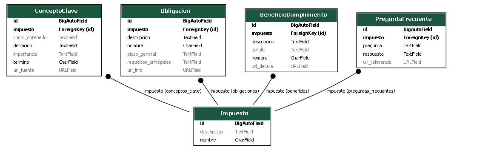

# PG2.PRACTICA3

# API de Cultura tributaria

**Descripción**

Esta API proporcionará información clave sobre el sistema tributario boliviano, diseñada para promover la cultura tributaria y combatir la desinformación respecto al tema. La API permitirá acceder a información sobre impuestos, obligaciones, conceptos clave (como NIT, RC-IVA, IUE, IVA, IT, etc.), beneficios de cumplir con los tributos y respuestas a preguntas frecuentes.

El objetivo de esta API es facilitar el desarrollo de aplicaciones educativas e integrar contenido tributario en plataformas escolares, universitarias o gubernamentales de Bolivia, contribuyendo a una mejor comprensión y cumplimiento fiscal en el país.

La API ha sido implementada utilizando Django y Django REST Framework, enfocándose en la exposición de datos de solo lectura para garantizar la seguridad, por lo que no requiere autenticación para su consumo.

# Modelos de Datos
1.  **Impuestos**
  - `Nombre`
  - `Sigla`
  - `Descripción general`
  - `Sujeto activo`
  - `Sujeto pasivo`
  - `Alícuota`
  - `Conceptos clave relacionados`
  - `Obligaciones relacionadas`

2.  **Obligaciones**
  - `Nombre`
  - `Descripción`
  - `Plazo general`
  - `Requisitos principales`
  - `Impuestos relacionados`

3.  **Conceptos Clave**
  - `Término`
  - `Definición`
  - `Importancia`
  - `Cómo obtenerlo (si aplica)`
    
4.  **Beneficios del Cumplimiento**
  - `Descripción`
  - `Detalle`
    
5.  **Preguntas Frecuentes**
  - `Pregunta`
  - `Respuesta`

## Requisitos previos
- Python 3.12 instalado
- pip


## Configuración y Ejecución del Proyecto 
## Crear entorno virtual
1. Abrir la terminal en el directorio del proyecto
2. Ejecutar el siguiente comando a continuación:

```bash
python -m venv env
```
Esto permitirá crear un directorio llamado `env` en el entorno virtual.

## Activar entorno virtual

* **Windows:**
```bash
.\env\Scripts\activate
```

* **Linux/Mac:**
```bash
source env/bin/activate
```
Después de activar el entorno virtual, `(env)` se mostrará al inicio de la linea de comandos.

## Crear archivo
Crear el archivo `requirements.txt` y dentro agregar:

```bash
django==5.2
django-extensions==4.1
djangorestframework==3.16.0
```
## Instalar dependencias
Tras la creacion del archivo usa `pip` para instalar las dependencias del proyecto:

```bash
pip install -r requirements.txt
```
## Desactivar entorno virtual
Cuando hayas terminado de trabajar en el proyecto, puedes desactivar el entorno virtual para volver a tu entorno global con este simple comando.

```bash
deactivate
```
## Crear proyecto Django
Para iniciar un nuevo proyecto, ejecuta:

```bash
django-admin startproject apitributaria .
```

## Aplicar migraciones
Aplica los cambios definidos a la base de datos mediante:

```bash
python manage.py migrate
```

## Iniciar servidor
Inicia el servidor de desarrollo para ver tu aplicación en funcionamiento con:

```bash
python manage.py runserver
```

## Crear superusuario
Crea un usuario con privilegios de administrador para gestionar su sitio `Django`

```bash
python manage.py createsuperuser
```

## Crear aplicación Django
Utiliza este comando para generar la estructura de archivos de la nueva aplicación. 

```bash
python manage.py startapp servicios
```

## Agregar aplicación a settings.py
  
En este punto es enecesario agregar el nombre de `django_extensions`y `servicios` a la lista `INSTALLED_APPS` dentro del archivo `settings.py` del proyecto, lo que informa a Django que esta aplicación debe ser tenida en cuenta.

```python
INSTALLED_APPS = [
    'django.contrib.admin',
    'django.contrib.auth',
    'django.contrib.contenttypes',
    'django.contrib.sessions',
    'django.contrib.messages',
    'django.contrib.staticfiles',
    'django_extensions',
    'rest_framework',
    'servicios',
]
```
## Definir modelos

Escribe el modelo en `servicios/models.py`:

```python
# servicios/models.py
from django.db import models

class Impuesto(models.Model):
    nombre = models.CharField(max_length=200)
    sigla = models.CharField(max_length=50, blank=True, null=True)
    descripcion_general = models.TextField(blank=True, null=True)
    sujeto_activo = models.CharField(max_length=200, blank=True, null=True)
    sujeto_pasivo = models.CharField(max_length=200, blank=True, null=True)
    alicuota = models.DecimalField(max_digits=5, decimal_places=2, blank=True, null=True)
    conceptos_clave_relacionados = models.ManyToManyField('ConceptoClave', blank=True, related_name='impuestos')
    obligaciones_relacionadas = models.ManyToManyField('Obligacion', blank=True, related_name='impuestos')

    def __str__(self):
        return self.nombre
    
class Obligacion(models.Model):
    nombre = models.CharField(max_length=200)
    descripcion = models.TextField(blank=True, null=True)
    plazo_general = models.CharField(max_length=100, blank=True, null=True)
    requisitos_principales = models.TextField(blank=True, null=True)
    impuestos_relacionados = models.ManyToManyField(Impuesto, blank=True, related_name='obligaciones')

    def __str__(self):
        return self.nombre

class ConceptoClave(models.Model):
    termino = models.CharField(max_length=200, unique=True)
    definicion = models.TextField(blank=True, null=True)
    importancia = models.TextField(blank=True, null=True)
    como_obtenerlo = models.TextField(blank=True, null=True)

    def __str__(self):
        return self.termino

class BeneficioCumplimiento(models.Model):
    descripcion = models.CharField(max_length=200)
    detalle = models.TextField(blank=True, null=True)

    def __str__(self):
        return self.descripcion

class PreguntaFrecuente(models.Model):
    pregunta = models.TextField()
    respuesta = models.TextField()

    def __str__(self):
        return self.pregunta
```

## Aplicar migraciones

```powershell
python manage.py makemigrations

```
```
python manage.py migrate

```
## Crear Superusuario (Opcional, para Admin Panel)

Si deseas acceder al panel de administración de Django para gestionar los datos, crea un superusuario:

```
python manage.py createsuperuser

```
Sigue las indicaciones para establecer un nombre de usuario, correo electrónico y contraseña.

## Iniciar el servidor de desarrollo
Para ver tu aplicación en funcionamiento, inicia el servidor local:

```
python manage.py runserver

```
La API estará accesible en http://127.0.0.1:8000/api/ y el panel de administración en http://127.0.0.1:8000/admin/.

---

## DIAGRAMA DE MODELOS
## Diagramar el MER de `models.py` usando Graphviz

Instalalo en tu sistema, puedes descargarlo desde: https://graphviz.gitlab.io/download/

luego ejecuta:

```bash
python manage.py graph_models servicios -o modelo.png
```
Este comando generara una imagen con nombre de `modelo.py` directamnente en la carpeta de `servicios`con el diagrama entidad y relacion

## Visualizacion del diagrama

Abre el archivo `modelo.png` y veras el diagrama MER.


--- 

## Endpoints de la API

La API expone los siguientes endpoints públicos (no requieren autenticación):

### 1. Impuestos

**Descripción:** Permite consultar información detallada sobre los diferentes impuestos.

* **Listar todos los impuestos:**
    * **URL:** `/api/impuestos/`
    * **Métodos Permitidos:** `GET`
    * **Argumentos:** Ninguno.
    * **Respuesta (Ejemplo):**
        ```json
        [
            {
                "id": 1,
                "nombre": "Impuesto al Valor Agregado",
                "sigla": "IVA",
                "descripcion_general": "Impuesto que grava el valor añadido en cada etapa de la cadena de producción.",
                "sujeto_activo": "Estado",
                "sujeto_pasivo": "Consumidor final",
                "alicuota": "13.00",
                "conceptos_clave_relacionados": [
                    {
                        "id": 101,
                        "termino": "Crédito Fiscal",
                        "definicion": "IVA pagado en compras y servicios que se puede descontar del IVA de ventas.",
                        "importancia": "Reduce la carga tributaria en ventas.",
                        "como_obtenerlo": "Mediante facturas de compra."
                    },
                    {
                        "id": 102,
                        "termino": "Débito Fiscal",
                        "definicion": "IVA cobrado en ventas y servicios.",
                        "importancia": "Representa el IVA a pagar al Estado.",
                        "como_obtenerlo": null
                    }
                ],
                "obligaciones_relacionadas": [
                    "Declaración Mensual IVA",
                    "Emisión de Facturas"
                ]
            }
            
        ]
        ```
* **Obtener detalles de un impuesto por sigla:**
    * **URL:** `/api/impuestos/{sigla}/`
    * **Métodos Permitidos:** `GET`
    * **Argumentos:**
        * `sigla` (path parameter): La sigla del impuesto (ej. `IVA`, `IT`).
    * **Respuesta (Ejemplo para `/api/impuestos/IVA/`):**
        ```json
        {
            "id": 1,
            "nombre": "Impuesto al Valor Agregado",
            "sigla": "IVA",
            "descripcion_general": "Impuesto que grava el valor añadido en cada etapa de la cadena de producción.",
            "sujeto_activo": "Estado",
            "sujeto_pasivo": "Consumidor final",
            "alicuota": "13.00",
            "conceptos_clave_relacionados": [
                {
                    "id": 101,
                    "termino": "Crédito Fiscal",
                    "definicion": "IVA pagado en compras y servicios que se puede descontar del IVA de ventas.",
                    "importancia": "Reduce la carga tributaria en ventas.",
                    "como_obtenerlo": "Mediante facturas de compra."
                },
                {
                    "id": 102,
                    "termino": "Débito Fiscal",
                    "definicion": "IVA cobrado en ventas y servicios.",
                    "importancia": "Representa el IVA a pagar al Estado.",
                    "como_obtenerlo": null
                }
            ],
            "obligaciones_relacionadas": [
                "Declaración Mensual IVA",
                "Emisión de Facturas"
            ]
        }
        ```
    * **Códigos de Estado:** `200 OK` (éxito), `404 Not Found` (si la sigla no existe).

### 2. Obligaciones

**Descripción:** Permite consultar las obligaciones fiscales y sus detalles.

* **Listar todas las obligaciones:**
    * **URL:** `/api/obligaciones/`
    * **Métodos Permitidos:** `GET`
    * **Argumentos:** Ninguno.
    * **Respuesta (Ejemplo):**
        ```json
        [
            {
                "id": 201,
                "nombre": "Declaración Mensual IVA",
                "descripcion": "Presentación de formulario para liquidar IVA.",
                "plazo_general": "Hasta el día 20 del mes siguiente.",
                "requisitos_principales": "Registro de compras y ventas.",
                "impuestos_relacionados": [
                    "Impuesto al Valor Agregado"
                ]
            }
            
        ]
        ```
* **Obtener detalles de una obligación por ID:**
    * **URL:** `/api/obligaciones/{id}/`
    * **Métodos Permitidos:** `GET`
    * **Argumentos:**
        * `id` (path parameter): El ID numérico de la obligación.
    * **Respuesta (Ejemplo para `/api/obligaciones/201/`):**
        ```json
        {
            "id": 201,
            "nombre": "Declaración Mensual IVA",
            "descripcion": "Presentación de formulario para liquidar IVA.",
            "plazo_general": "Hasta el día 20 del mes siguiente.",
            "requisitos_principales": "Registro de compras y ventas.",
            "impuestos_relacionados": [
                "Impuesto al Valor Agregado"
            ]
        }
        ```
    * **Códigos de Estado:** `200 OK`, `404 Not Found`.

### 3. Conceptos Clave

**Descripción:** Proporciona definiciones y detalles sobre términos tributarios importantes.

* **Listar todos los conceptos clave:**
    * **URL:** `/api/conceptos/`
    * **Métodos Permitidos:** `GET`
    * **Argumentos:** Ninguno.
    * **Respuesta (Ejemplo):**
        ```json
        [
            {
                "id": 101,
                "termino": "Crédito Fiscal",
                "definicion": "IVA pagado en compras y servicios que se puede descontar del IVA de ventas.",
                "importancia": "Reduce la carga tributaria en ventas.",
                "como_obtenerlo": "Mediante facturas de compra."
            }
            
        ]
        ```
* **Obtener detalles de un concepto clave por término:**
    * **URL:** `/api/conceptos/{termino}/`
    * **Métodos Permitidos:** `GET`
    * **Argumentos:**
        * `termino` (path parameter): El término del concepto clave (ej. `CreditoFiscal`, `Retencion`).
    * **Respuesta (Ejemplo para `/api/conceptos/CreditoFiscal/`):**
        ```json
        {
            "id": 101,
            "termino": "Crédito Fiscal",
            "definicion": "IVA pagado en compras y servicios que se puede descontar del IVA de ventas.",
            "importancia": "Reduce la carga tributaria en ventas.",
            "como_obtenerlo": "Mediante facturas de compra."
        }
        ```
    * **Códigos de Estado:** `200 OK`, `404 Not Found`.

### 4. Beneficios por Cumplimiento

**Descripción:** Detalla los beneficios que se obtienen al cumplir con las normativas fiscales.

* **Listar todos los beneficios:**
    * **URL:** `/api/beneficios/`
    * **Métodos Permitidos:** `GET`
    * **Argumentos:** Ninguno.
    * **Respuesta (Ejemplo):**
        ```json
        [
            {
                "id": 301,
                "descripcion": "Exención de Multas e Intereses",
                "detalle": "Al cumplir con los plazos, se evitan recargos y sanciones."
            }
            
        ]
        ```
* **Obtener detalles de un beneficio por ID:**
    * **URL:** `/api/beneficios/{id}/`
    * **Métodos Permitidos:** `GET`
    * **Argumentos:**
        * `id` (path parameter): El ID numérico del beneficio.
    * **Respuesta (Ejemplo para `/api/beneficios/301/`):**
        ```json
        {
            "id": 301,
            "descripcion": "Exención de Multas e Intereses",
            "detalle": "Al cumplir con los plazos, se evitan recargos y sanciones."
        }
        ```
    * **Códigos de Estado:** `200 OK`, `404 Not Found`.

### 5. Preguntas Frecuentes

**Descripción:** Conjunto de preguntas y respuestas comunes sobre la temática fiscal.

* **Listar todas las preguntas frecuentes:**
    * **URL:** `/api/preguntas/`
    * **Métodos Permitidos:** `GET`
    * **Argumentos:** Ninguno.
    * **Respuesta (Ejemplo):**
        ```json
        [
            {
                "id": 401,
                "pregunta": "¿Qué es el NIT?",
                "respuesta": "El NIT (Número de Identificación Tributaria) es un código único asignado a contribuyentes."
            }
            
        ]
        ```
* **Obtener detalles de una pregunta frecuente por ID:**
    * **URL:** `/api/preguntas/{id}/`
    * **Métodos Permitidos:** `GET`
    * **Argumentos:**
        * `id` (path parameter): El ID numérico de la pregunta.
    * **Respuesta (Ejemplo para `/api/preguntas/401/`):**
        ```json
        {
            "id": 401,
            "pregunta": "¿Qué es el NIT?",
            "respuesta": "El NIT (Número de Identificación Tributaria) es un código único asignado a contribuyentes."
        }
        ```
    * **Códigos de Estado:** `200 OK`, `404 Not Found`.

---

## Ejemplo de Caso de Uso del API

**Escenario:** Un desarrollador quiere crear una aplicación que ayude a los usuarios a entender sus obligaciones fiscales relacionadas con un impuesto específico, y también a encontrar la definición de un concepto clave.

1.  **Encontrar la información de un impuesto específico (ej., IVA):**
    * **Endpoint:** `/api/impuestos/IVA/`
    * **Método:** `GET`
    * **Uso:** La aplicación haría una solicitud GET a esta URL para obtener los detalles del Impuesto al Valor Agregado.
    * **Respuesta esperada:** Un JSON con la descripción, alícuota, sujetos, y listas de conceptos y obligaciones relacionadas con el IVA, como se muestra en el ejemplo de respuesta del endpoint de detalle de `Impuestos`.

2.  **Consultar las obligaciones relacionadas con ese impuesto:**
    * **Endpoint:** `/api/obligaciones/`
    * **Método:** `GET`
    * **Uso:** Una vez obtenida la información del IVA, la aplicación podría filtrar o buscar en la lista de obligaciones devuelta por este endpoint (o simplemente mostrar las `obligaciones_relacionadas` directamente del objeto Impuesto) para presentar al usuario las obligaciones específicas como "Declaración Mensual IVA". Si se necesitara más detalle de una obligación particular, se usaría el endpoint de detalle de `Obligaciones` con su ID.
    * **Ejemplo (si se necesitara más detalle de una obligación del IVA, asumiendo su ID es 201):**
        * **Endpoint:** `/api/obligaciones/201/`
        * **Método:** `GET`
        * **Uso:** La aplicación haría una solicitud GET a esta URL para obtener los detalles de la obligación "Declaración Mensual IVA".

3.  **Buscar la definición de un concepto clave (ej., "Crédito Fiscal"):**
    * **Endpoint:** `/api/conceptos/CreditoFiscal/`
    * **Método:** `GET`
    * **Uso:** Si el usuario tiene dudas sobre un término como "Crédito Fiscal", la aplicación puede realizar una solicitud GET a esta URL para recuperar su definición, importancia y cómo obtenerlo.
    * **Respuesta esperada:** Un JSON con la definición completa del "Crédito Fiscal", como se muestra en el ejemplo de respuesta del endpoint de detalle de `Conceptos Clave`.